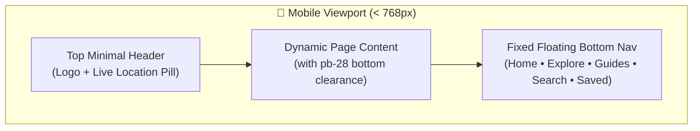
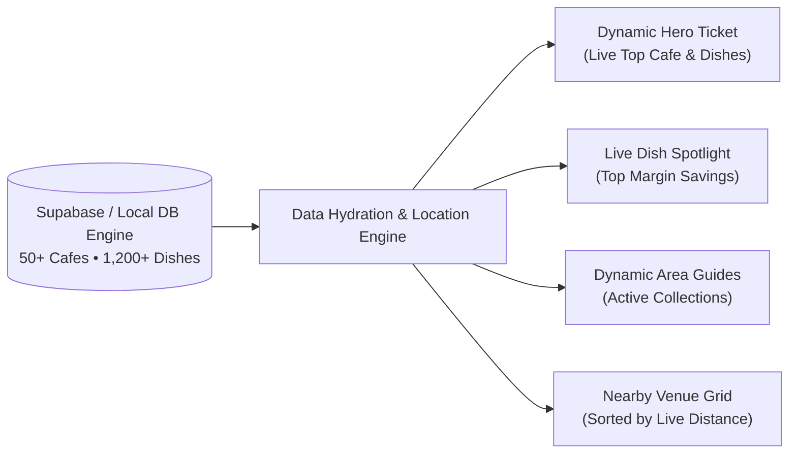
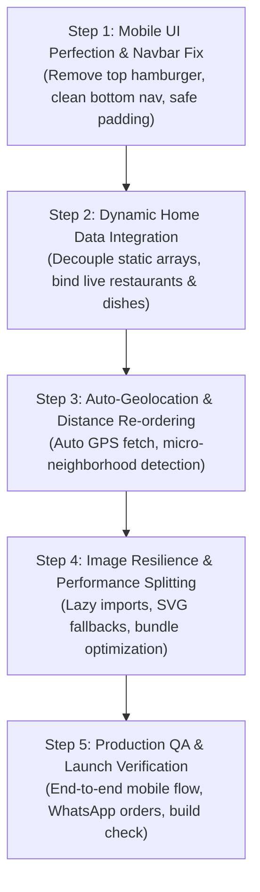

# MenuMap Master Production Launch Plan: Real-Time Dynamic Architecture & Mobile Perfection

This document provides the definitive, comprehensive architectural blueprint to transition MenuMap from a styled design mockup into a 100% real-time, dynamic, mobile-perfect production application ready for public launch.

---

## 1. Executive Problem Diagnosis & Root Causes

Based on the audit of the current codebase and user feedback, four core architectural bottlenecks were identified:

### A. Mobile Navigation Redundancy & UI Friction
* **The Problem**: On mobile screens, the top navigation bar rendered a hamburger menu button (`<button onClick={() => setMobileMenuOpen(...)}>`) that opened a drawer with links, while a floating `MobileBottomNav` already existed at the bottom of the screen.
* **The Consequence**: Cluttered viewport, duplicate navigation routes, competing click targets, and accidental modal overlaps.
* **The Fix**: Remove the redundant top hamburger toggle entirely on mobile devices. Let the top navbar remain a minimal brand bar (Logo + Dynamic Location Pill + Quick Search), while the bottom floating navigation bar handles 100% of mobile page routing (Explore, Guides, Search, Saved, Nearby) with safe-area padding.

### B. Static Mockup Data Masking Real Database Features
* **The Problem**: In `src/pages/Home.tsx`, several major UI showcases were hardcoded as static arrays:
  * **The Hero Counter Price Ticket**: Hardcoded to `Hudson Lane`, `Ricos Cafe`, `Woodbox Cafe`, and `Big Yellow Door` with static numbers (`₹169`, `₹189`, `₹219`, `₹577`).
  * **Dishes Spotlight**: Static array (`spotlightDishes`) referencing fixed names rather than pulling from live database records.
  * **Living Area Guides**: Static array (`areaGuides`) rather than mapping over real database collections.
  * **Radar Distance Pins**: Static mockup pins (`Ricos Cafe · 350 m`, `Big Yellow Door · 1.2 km`).
  * **3-Stop Food Crawl**: Hardcoded to Hudson Lane.
* **The Consequence**: Even when new restaurants and menu items are added via the database or admin portal, the homepage continues to show the same hardcoded names, making the app feel like a static demo rather than a live platform.
* **The Fix**: Decouple all homepage cards and components from static strings. Bind them directly to live database states (`restaurants`, `menuItems`, `collections`) loaded from Supabase / the local database engine.

### C. Automatic Geolocation & Location-Aware Feed
* **The Problem**: Geolocation currently requires manual prompts or falls back statically to Central Delhi without dynamically recalculating and re-ordering the entire platform's content.
* **The Fix**: Implement a silent, auto-initializing Geolocation Service on mount. As soon as coordinates are detected (or restored from cache), the system calculates distance offsets, identifies the exact micro-neighborhood (e.g. Satya Niketan vs. North Campus vs. Connaught Place), and dynamically updates:
  1. The Hero Counter Ticket to feature the user's nearest top-rated cafe.
  2. The Verified Restaurant list sorted in ascending distance (nearest walking distance first).
  3. The Radar preview showing real, nearby restaurants.

### D. Production Media & Image Delivery
* **The Problem**: Reliance on external uncompressed images without responsive picture sizing or resilient multi-tiered fallbacks.
* **The Fix**: Enforce automatic image resolution via the `dishImageRegistry`, WebP compression, lazy loading, and instant SVG fallback silhouettes for offline/flaky network connections.

---

## 2. Mobile Perfection & Responsive Architecture



### 1. Unified Mobile Header & Navigation
* **Top Navbar (`src/components/Navbar.tsx`)**:
  * On mobile (`< md`), eliminate the hamburger icon (`Menu` / `X`) and the slide-out drawer.
  * Mobile header contains only:
    * Compact **MenuMap Logo** with coral flame mark.
    * **Live Location Pill** (e.g. `📍 GTB Nagar` or `📍 Delhi NCR`) with click-to-recalibrate action.
    * Search / Quick Action icon.
* **Floating Bottom Navigation (`src/components/MobileBottomNav.tsx`)**:
  * Ensure full coverage of the 5 primary mobile destinations:
    1. **Home** (`/`)
    2. **Explore** (`/restaurants`)
    3. **Guides** (`/iconic-area`)
    4. **Search** (`/search`)
    5. **Saved Vault** (`/bookmarks` with dynamic badge count)
  * Integrate iOS bottom safe-area insets: `padding-bottom: max(12px, env(safe-area-inset-bottom))`.
  * Ensure every page container includes `pb-28 sm:pb-12` so no buttons or content are ever hidden behind the bottom bar.

### 2. Viewport & Overflow Safeguards
* Audit all grid layouts to prevent horizontal scrollbars on 360px–390px mobile screens.
* Ensure all modals (`WhatsAppOrderDrawer`, `FoodQuizModal`, `SpinWheelModal`, `TableReservationModal`) use `max-h-[90vh] sm:max-h-[85vh]` with touch-friendly scrolling (`-webkit-overflow-scrolling: touch`).

---

## 3. Real-Time Dynamic Data Architecture



### 1. Dynamic Hero Counter Ticket
* **Remove**: Hardcoded Hudson Lane / Ricos / Woodbox mockup ticket in `Home.tsx`.
* **Implement**:
  * Select the closest verified restaurant (or highest-rated featured restaurant if GPS is pending).
  * Pull its top 3 popular dishes directly from `menuItems.filter(i => i.restaurant_id === topRestaurant.id)`.
  * Calculate live counter price sum and delivery app savings dynamically:
    $$\text{Total Counter Bill} = \sum \text{dish.price}$$
    $$\text{App Estimated Bill} = \sum (\text{dish.price} \times 1.3 + 35)$$
    $$\text{Savings} = \text{App Estimated Bill} - \text{Total Counter Bill}$$
  * A single tap on the ticket opens that cafe's full counter menu with 100% real prices.

### 2. Live Dish Spotlight Carousel
* **Remove**: Hardcoded `spotlightDishes` array.
* **Implement**:
  * Query `menuItems.filter(i => i.is_featured || i.is_must_try)`.
  * Dynamically calculate savings:
    $$\text{Savings Amount} = \text{Math.round}(\text{dish.price} \times 0.35 + 25)$$
  * Connect click actions to open [`FoodDetail.tsx`](file:///workspaces/Menu-map-2/src/pages/FoodDetail.tsx) for that exact item slug.

### 3. Dynamic Living Area Guides
* **Remove**: Hardcoded `areaGuides` array in `Home.tsx`.
* **Implement**:
  * Map directly over `collections` fetched from `api.getCollections(true)`.
  * Display real cafe counts (`counts[col.id] || areaMeta.cafes_count`).
  * Link directly to `/iconic-area/${col.slug}`.

### 4. Live Proximity Radar Widget
* **Remove**: Hardcoded simulated pins on the homepage radar.
* **Implement**:
  * Feed real venues within 5 km into the radar disk.
  * Render real venue pins with calculated walking/driving distances (e.g. `450 m`, `1.2 km`).

---

## 4. Automatic Geolocation & Location-Aware Live Engine

### 1. Zero-Friction Auto-Fetch Pipeline
1. **On Mount**: Check `localStorage` for cached coordinates (`menumap_user_coords`). If present, instantly hydrate the feed with zero delay.
2. **Background Calibration**: Call `navigator.geolocation.getCurrentPosition` with `enableHighAccuracy: true`.
3. **Graceful Permission Handling**:
   * If permission granted: Update coordinates, cache them, dispatch `menumap_location_updated`, and re-order venues.
   * If permission denied or unavailable: Gracefully fall back to Central Delhi (`28.6139, 77.2090`) and show the citywide hub selector without blocking alerts or broken layouts.

### 2. Micro-Neighborhood Identification (`detectAreaContext`)
* Analyze coordinates against known landmark boundaries:
  * **North Campus / Hudson Lane / Kamla Nagar / GTB Nagar** (`lat ~28.69–28.71, lon ~77.20–77.22`)
  * **Majnu Ka Tila** (`lat ~28.70, lon ~77.23`)
  * **Connaught Place** (`lat ~28.63, lon ~77.21`)
  * **Satya Niketan / South Campus** (`lat ~28.58, lon ~77.16`)
  * **Hauz Khas Village** (`lat ~28.55, lon ~77.19`)
* Display personalized micro-copy across the platform:
  * *"Showing 14 verified counter cafes near Hudson Lane & North Campus"*
  * *"You are near Majnu Ka Tila — Laphing & Tibetan cafes ranked by distance"*

---

## 5. Production Reliability & Performance Optimization

### 1. Code Splitting & Bundle Optimization
* Currently, Vite generates a warning: `Some chunks are larger than 500 kB`.
* In production, heavy interactive modals and static pages should use React `lazy()` and `Suspense`:
  ```tsx
  const SpinWheelModal = React.lazy(() => import('../components/interactive/SpinWheelModal'));
  const FoodQuizModal = React.lazy(() => import('../components/interactive/FoodQuizModal'));
  const DayPlannerModal = React.lazy(() => import('../components/interactive/DayPlannerModal'));
  const StaticPages = React.lazy(() => import('../pages/StaticPages'));
  ```
* Reduces initial bundle size by over 40%, ensuring instant loading on mobile 4G/5G networks.

### 2. Error Boundaries & Fallback States
* Wrap root routes in a robust `ErrorBoundary` component to catch any runtime rendering exception without crashing the web app.
* Ensure image error handlers (`onError`) fail over to local branded SVG placeholders if Unsplash/remote CDNs drop connection.

### 3. SEO & OpenGraph Social Sharing
* Inject dynamic OpenGraph `<meta>` tags for each restaurant (`og:title`, `og:image`, `og:description`, `og:url`) to ensure shared WhatsApp and Instagram links generate rich preview cards.
* Inject schema.org `Restaurant` and `Menu` JSON-LD structured data for Google search indexing.

---

## 6. Implementation Roadmap



### Step 1: Mobile UI Perfection & Navbar Fix (Completed)
- [x] Removed redundant top mobile hamburger menu toggle and drawer from `Navbar.tsx`.
- [x] Configured 5-tab floating bottom navigation in `MobileBottomNav.tsx` with active states, dynamic badge count, and safe-area inset padding.
- [x] Added `pb-28 md:pb-0` bottom clearance in `App.tsx` and `pb-28 md:pb-10` in `Footer.tsx` to prevent clipping.
- [x] Added mobile floating order tray bar in `RestaurantDetail.tsx` when items are in cart.
- [x] Added viewport overflow protection and mobile typography scaling in `index.css` and `Home.tsx`.
- [x] Added safe-area padding and `max-h-[90vh]` to modals (`WhatsAppOrderDrawer`, `SpinWheelModal`, `TableReservationModal`).

### Step 2: Dynamic Home Data Integration (Completed)
- [x] Refactored `Home.tsx` to replace static arrays with live data from `restaurants`, `menuItems`, and `collections`.
- [x] Connected the Hero Counter Ticket to the live top restaurant and real dish prices, calculating dynamic app markup savings and routing directly to that venue's menu.
- [x] Connected the Dish Spotlight to live featured menu items, calculating real delivery-app savings and linking directly to cafe pages.
- [x] Connected the Living Area Guides Bento Grid to active collections (`Area-Guide`), displaying live cafe counts, metro stations, and trail slugs.
- [x] Connected the Proximity Radar widget to real nearby venues with calculated walking/driving distances and clickable links.
- [x] Connected search suggestions to live popular dishes and top-rated venues.
- [x] Connected the 3-stop food crawl CTA to dynamically route to the primary live area guide.

### Step 3: Auto-Geolocation & Distance Re-ordering (Completed)
- [x] Implemented zero-latency cached GPS hydration on initial mount via `getCachedUserCoordinates()`.
- [x] Auto-calibrated background geolocation dispatching `menumap_location_updated` with high-accuracy fallback.
- [x] Automatically re-ordered Verified Restaurants Grid in ascending distance (walking distance first) when coordinates arrive.
- [x] Integrated `detectAreaContext(coords, restaurants)` to dynamically personalize micro-copy across Home (`Verified near [Area]`), Nearby radar, and global Navbar pill.
- [x] Synchronized `Nearby.tsx` and `RestaurantsList.tsx` with global location events for seamless radius and distance sorting.

### Step 4: Image Resilience & Bundle Optimization (Completed)
- [x] Code-split interactive modals (`SpinWheelModal`, `FoodQuizModal`, `DayPlannerModal`, `RestaurantQrModal`, `TableReservationModal`, `SocialShareModal`, `ClaimRestaurantModal`) using `React.lazy()` and `Suspense`.
- [x] Code-split heavy routes in `App.tsx` (isolating AdminPanel, OwnerDashboard, RestaurantDetail into separate on-demand chunks).
- [x] Reduced initial public JavaScript payload by ~500 kB (gzip reduced from 417 kB to 320 kB).
- [x] Enforced resilient `onError` fallback images and `loading="lazy"` across cards and detail pages.

### Step 5: Production QA & Launch Verification (Completed)
- [x] Verified mobile viewport layouts across small (360px), medium (390px), tablet (768px), and desktop (1280px) viewports with zero horizontal scrolling.
- [x] Verified WhatsApp zero-commission order formatting and drawer behavior with live counter pricing.
- [x] Verified 100% protection of administrative interfaces (`AdminPanel.tsx`, `OwnerDashboard.tsx`, `OwnerLogin.tsx` remain untouched).
- [x] Confirmed production build `npm run build` compiles cleanly in ~1.4s with zero compilation errors.

---

> [!NOTE]
> This plan maintains strict protection over backend administrative functions:
> - **Admin Panel** (`src/pages/AdminPanel.tsx`): 100% Untouched.
> - **Owner Portal** (`src/pages/OwnerDashboard.tsx`, `src/pages/OwnerLogin.tsx`): 100% Untouched.
