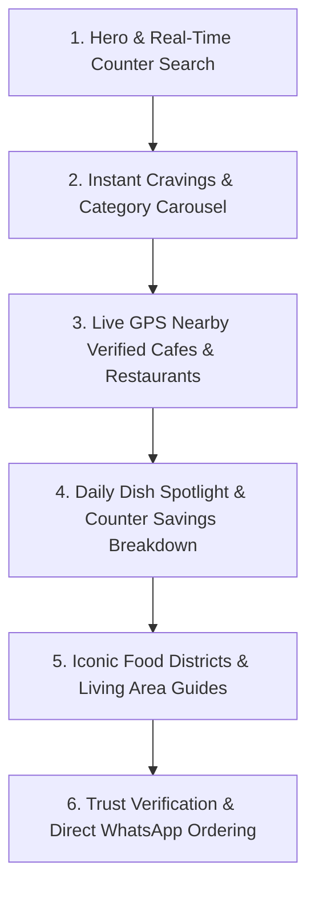

# MenuMap: Production Redesign & Real-Time Engine Master Plan

> **Document Version**: 2.0.0  
> **Status**: Ready for Execution & Client Review  
> **Target System**: MenuMap Web Application (`React 18` + `TypeScript` + `Vite` + `Tailwind CSS` + `Supabase`)  
> **Core Objective**: Execute a production-grade visual, responsive, algorithmic, and architectural overhaul across the entire website, removing temporary hacks, locking in the authentic brand identity, eliminating redundant routes, standardizing mobile layouts, and deploying a real-time recommendation engine connected directly to live database tables.

---

## Executive Summary & Problem Diagnosis

Based on rigorous codebase inspection and user feedback, 6 critical challenges were identified:

1. **Logo Inconsistencies & Fragile Admin Logo Systems**:
   - The authentic brand logo is located at `/workspaces/Menu-map-2/asset provide/logo.jpg` (3264×3264 px high-res square brand logo).
   - In various places, inline SVG vector placeholders, generic emojis, or dummy icons are being displayed.
   - The browser favicon is loaded from temporary SVGs or local storage overrides in `AdminPanel.tsx` (`custom_favicon_url`), creating configuration conflicts, broken image states, and visual discrepancies across devices.
2. **Mobile Layout Broken on Small Screens**:
   - **Hero Section**: Fixed padding (`px-6`), oversized headlines (`text-4xl` to `text-[84px]`), and negative absolute badge margins (`-left-6 -top-6` on the counter ticket) push content offscreen and introduce horizontal scrollbars on mobile phones (< 390px).
   - **Dishes & Food Detail Pages** (`Search.tsx`, `FoodDetail.tsx`): Content clipping on mobile viewports, stacked filter trays taking up entire screens, and non-optimized touch targets.
   - **Area Guides** (`CollectionsList.tsx`, `CollectionDetail.tsx`): The UI feels completely detached from the rest of the website—using conflicting Tailwind color shades (`slate-900`, `orange-600`, `emerald-700` instead of the design system `#14110F`, `#FF5A36`, `#0F766E`), awkward card dimensions, inconsistent typography, and overflowing category chips.
3. **Redundant "Nearby" Page Duplication**:
   - `/nearby` (`Nearby.tsx`) mirrors 95% of the logic found in `/restaurants` (`RestaurantsList.tsx`). Having two separate routes creates user confusion, clutters navigation, and dilutes SEO authority.
4. **Homepage Clutter & Cognitive Overload**:
   - The homepage contains over 1,600 lines of code spanning 12 disconnected sections (nested search switcher, multi-tab dropdowns, floating radar items, 3-stop timeline, review widgets, gamification modals, multiple CTA banners). It lacks an intuitive, laser-focused visual hierarchy.
5. **Static / Demo Data in Place of Real Algorithms**:
   - Suggestions, spotlight items, and recommendations currently rely on static fallback arrays rather than dynamic, mathematical algorithms calculated in real time against live database rows.

---

## 1. Unified Real Logo Architecture (Platform-Wide)

### 1.1 Source Asset
- **Source File**: `/workspaces/Menu-map-2/asset provide/logo.jpg`
- **Integrity Requirement**: **Zero modification, zero distortion, zero color-filter alteration.**

### 1.2 Static File Placement
```bash
# Deployed to public root for direct static serving
/workspaces/Menu-map-2/public/logo.jpg
```
- `index.html` updates:
  ```html
  <!-- Browser Tab Favicon (Chrome, Safari, Edge, Firefox) -->
  <link rel="icon" type="image/jpeg" href="/logo.jpg" />
  <link rel="alternate icon" type="image/jpeg" href="/logo.jpg" />
  <link rel="apple-touch-icon" href="/logo.jpg" />
  ```

### 1.3 Component Standardization (`src/components/Logo.tsx`)
Refactor `src/components/Logo.tsx` to serve the exact image across all application contexts:
```tsx
export const MenuMapLogo: React.FC<LogoProps> = ({ 
  className = 'w-10 h-10', 
  size = 40,
  rounded = 'rounded-xl' 
}) => {
  return (
    
  );
};

export const MenuMapBrand: React.FC<{ 
  lightText?: boolean; 
  textSize?: string; 
  className?: string;
  iconSize?: number;
}> = ({
  lightText = false,
  textSize = 'text-2xl',
  className = '',
  iconSize = 38,
}) => {
  return (
    <div className={`flex items-center gap-2.5 font-extrabold tracking-tight select-none ${className}`}>
      <MenuMapLogo size={iconSize} className="shrink-0" />
      <span className={`hd ${textSize} font-black tracking-tight ${lightText ? 'text-white' : 'text-[#14110F]'}`}>
        Menu<span className="text-[#FF5A36]">Map</span>
      </span>
    </div>
  );
};
```

### 1.4 Elimination of Admin Panel Favicon Uploader & Overrides
- **File**: `src/pages/AdminPanel.tsx`
- **Actions**:
  1. Remove lines `3179–3310` containing the Browser Tab Favicon uploader, the live Chrome tab simulator, file input handlers, custom URL inputs, and preset switcher buttons.
  2. Remove `applyBrowserFavicon` import and invocation.
  3. Retire `src/lib/favicon.ts`.
  4. Ensure `localStorage.removeItem('custom_favicon_url')` is triggered so no stale cached client override can replace the brand logo.

### 1.5 Global Audit Checklist
- [x] Desktop Navigation Header (`src/components/Navbar.tsx`)
- [x] Mobile Slide-out Drawer & Navigation
- [x] Application Footer (`src/components/Footer.tsx`)
- [x] QR Counter Card Generator (`src/components/qr/QRCodeGenerator.tsx`)
- [x] Admin Panel Header & Branding View
- [x] Auth & Modal Overlays

---

## 2. Navigation Streamlining & Deprecation of "Nearby"

### 2.1 The Problem
Users currently see both "Explore" (`/restaurants`) and "Nearby" (`/nearby`). Both load restaurants, both have proximity calculations, and both filter by dietary preference. This splits user attention.

### 2.2 Solution: Unified Discovery Hub in Explore
1. **Consolidate into `src/pages/RestaurantsList.tsx`**:
   - Add a prominent, one-tap **"📍 Near Me"** toggle pill at the top of the Explore page.
   - When tapped:
     - Automatically requests/reads live GPS coordinates via `getUserLocation()`.
     - Automatically re-orders restaurant cards by distance (`0.2 km`, `0.6 km`, `1.4 km`).
     - Activates a radius distance slider (1 km, 3 km, 5 km, 10 km).
     - Renders a clean "GPS Active · Showing closest venues first" status bar.
2. **Retire `/nearby` Route (`src/App.tsx`)**:
   - Update `src/App.tsx` router so that any visit to `/nearby` smoothly redirects to `/restaurants?sort=distance`.
   - Remove standalone `Nearby.tsx` lazy bundle.
3. **Mobile Bottom Navigation Optimization (`src/components/MobileBottomNav.tsx`)**:
   - Replace the cramped 5-tab bar with **4 balanced, thumb-friendly navigation tabs**:
     | Tab Index | Route | Icon | Label | Focus |
     |---|---|---|---|---|
     | **1** | `/` | `Home` | Home | Real-time Search & Highlights |
     | **2** | `/restaurants` | `Compass` | Explore | Full Directory with "Near Me" GPS Sort |
     | **3** | `/iconic-area` | `MapPin` | Guides | Living Area Food Guides & Trails |
     | **4** | `/bookmarks` | `Bookmark` | Saved | Bookmarked Menus, Cafes & Dishes |
4. **Desktop Navigation (`src/components/Navbar.tsx`)**:
   - Remove "Nearby" from top desktop header links. Clean nav links: **Explore Menus**, **Iconic Areas**, **Saved**.

---

## 3. Mobile Responsiveness & Layout Overhaul

### 3.1 Homepage Top Hero Section Redesign
#### Identified Defects on Mobile:
- Headline size (`text-4xl` to `text-6xl`) causes bad line breaks on 360–390px screens.
- Search container has nested dish/cafe switcher tabs (`w-max`) which horizontally clip on mobile.
- Floating receipt ticket has negative margins (`-left-6 -top-6` badge, `-mx-8` ticket cutouts) causing horizontal window scrolling.
- Too much text before any interactive element is visible.

#### Architectural Redesign for Hero:
1. **Mobile-First Typography**:
   ```tsx
   /* Scaled cleanly from iPhone SE (320px) to 4K displays */
   <h1 className="hd text-3xl sm:text-5xl lg:text-7xl font-black text-white leading-[1.08] sm:leading-[0.96] tracking-tight">
     Eat at <span className="text-[#FF5A36]">counter prices.</span><br className="hidden sm:inline" />
     Not app prices.
   </h1>
   ```
2. **Unified, Clean Mobile Search Bar**:
   - Replace the confusing 2-mode tab toggle with a single, ultra-fast universal search bar.
   - Search accepts dish names (e.g., *"Momos"*), cuisines (*"Tibetan"*), cafe names (*"Big Yellow Door"*), or areas (*"Hudson Lane"*).
   - Instant search pills displayed in a single-row horizontal swipe carousel below the input.
3. **Responsive Counter Ticket Preview**:
   - On screens `< 768px`: Render as an inline, flat-bound receipt card with `rotate-0` and zero negative absolute margins.
   - Perforation lines styled cleanly with CSS radial masks or contained pseudo-elements that never exceed `100vw`.
   - Dynamic live price breakdown comparing real counter total vs food delivery app markup with verified savings badge.

---

### 3.2 Food Detail Page Mobile Perfection (`src/pages/FoodDetail.tsx`)
1. **Responsive Media Container**:
   - Mobile: `aspect-[16/10]` or `aspect-[4/3]` with curved bottom sheet edges.
   - Floating veg/non-veg indicator and share/bookmark buttons positioned with safe-area insets (`top-3.5 right-3.5`).
2. **Counter Slip & Price Transparency Bento Box**:
   - Single-column stacked layout on mobile.
   - Prominent price comparison: Counter Price (`₹169`) in bold coral next to delivery app price (`₹260` strike-through) with a prominent badge: *"Save ₹91 (35%) at counter"*.
3. **Action Floating Dock**:
   - Clean sticky bottom action bar on mobile with:
     - Direct WhatsApp Order Button (counter price pre-filled).
     - Direct Google Maps Navigation Button.

---

### 3.3 Search & Dishes Exploration Mobile Perfection (`src/pages/Search.tsx`)
1. **Filter Drawer for Mobile**:
   - Replace bulky, vertical inline filter accordions with a clean **"Filters & Sort"** floating pill that opens a lightweight bottom sheet on mobile devices.
2. **Dish Grid Viewport**:
   - Mobile: Clean 1-column or 2-column compact grid with 44px minimum tap targets.
   - No horizontal clipping of dish tags or pricing badges.

---

## 4. Area Guides Harmonization (`CollectionsList.tsx` & `CollectionDetail.tsx`)

### 4.1 Visual Discrepancy Diagnosis
The Area Guides page currently looks like a completely different website:
- Uses harsh `slate-900` / `slate-600` colors instead of MenuMap's Obsidian `#14110F` and Stone `#57534E`.
- Uses bright saturated gradients (`from-emerald-500 via-orange-500 to-amber-500`) that clash with the warm editorial theme.
- Card titles, badges, and dish spotlight modals have non-standard borders, roundedness, and spacing.

### 4.2 Universal Design System Alignment
1. **Color Tokens**:
   - Background: `#FAF8F5` (Warm Cream)
   - Primary Surface: `#FFFFFF` with `#EFEAE2` subtle borders
   - Headings & Primary Text: `#14110F`
   - Secondary Text: `#57534E`
   - Accent & Highlights: `#FF5A36` (Coral) & `#0F766E` (Teal)
2. **Standardized Card Architecture (`src/components/CollectionCard.tsx`)**:
   - Standardized aspect ratio `aspect-[16/10]` for neighborhood cover images.
   - Unified metro connectivity badge: `🚇 GTB Nagar (Gate 3)`.
   - Live GPS distance pill: `📍 1.2 km from you`.
   - Signature dish preview row with verified counter pricing.
3. **Mobile-Friendly Zone Switcher**:
   - Implement horizontal scroll container with `no-scrollbar` and flex shrink-0 pills:
     `All Delhi NCR` · `North Campus & Hudson` · `West Delhi & Rajouri` · `Central & CP` · `South Delhi & HKV`.
4. **Dish Spotlight Bottom Sheet**:
   - On mobile screens, replace the centered desktop modal with a touch-friendly bottom sheet drawer with backdrop blur.

---

## 5. Homepage Simplification & Narrative Architecture

### 5.1 Current Clutter vs. Proposed Streamlined Flow
The current homepage tries to display too much at once. We propose streamlining it into **6 high-impact narrative blocks**:



### 5.2 Section-by-Section Specification
1. **Section 1: Hero & Real-Time Counter Search**:
   - Crisp value proposition: Real menus, exact counter prices, zero app markups.
   - Universal search input with live typeahead.
   - Responsive counter ticket comparison card.
2. **Section 2: Instant Cravings & Category Bar**:
   - One-tap horizontal pills: 🥟 Momos, 🥤 Monster Shakes, 🫓 Chur Chur Naan, ☕ Coffee & Cafes, 🌿 Pure Veg, 🌙 Late Night.
3. **Section 3: Live GPS Nearby Verified Restaurants**:
   - Displays real restaurants sorted in real-time by GPS distance.
   - Shows walking/driving distance, verified badge, and average savings.
4. **Section 4: Daily Dish Spotlight & Counter Savings**:
   - Highlights 3 curated bestselling dishes pulled directly from active menu records.
   - Demonstrates exact price transparency (Counter ₹ vs App ₹).
5. **Section 5: Iconic Food Districts & Walking Trails**:
   - Bento grid showcasing iconic neighborhoods (Hudson Lane, Satya Niketan, Majnu Ka Tila, CP).
   - Displays metro connectivity, student budget ratings, and famous signature dishes.
6. **Section 6: Zero Commission Trust Manifesto & WhatsApp Ordering**:
   - Explains why MenuMap is free for restaurants and transparent for diners.
   - Quick WhatsApp direct connect for diners on the go.

---

## 6. Real-Time Dynamic Recommendation & Suggestion Algorithm

### 6.1 The Mathematical Scoring Engine
To replace hardcoded static arrays with a robust, real-time recommendation engine, we introduce a **Multi-Factor Scoring Algorithm**:

$$\text{FinalScore}(i, u, t) = w_{\text{geo}} \cdot S_{\text{dist}} + w_{\text{time}} \cdot S_{\text{meal}} + w_{\text{pop}} \cdot S_{\text{rating}} + w_{\text{deal}} \cdot S_{\text{savings}} + w_{\text{fresh}} \cdot S_{\text{freshness}}$$

Where:
- $i$ = Candidate Restaurant or Menu Item
- $u$ = User Context (Live GPS coordinates, past bookmarks, preferences)
- $t$ = Current Local System Time

---

### 6.2 Component Scoring Breakdown

#### 1. Proximity Decay Function ($S_{\text{dist}}$)
Calculated using the **Haversine Formula**:
$$d = 2R \cdot \arcsin\left(\sqrt{\sin^2\left(\frac{\Delta \text{lat}}{2}\right) + \cos(\text{lat}_1)\cos(\text{lat}_2)\sin^2\left(\frac{\Delta \text{lng}}{2}\right)}\right)$$
Proximity decay score with half-life $\lambda = 0.28$:
$$S_{\text{dist}} = e^{-\lambda \cdot d}$$
- $d = 0.5\text{ km} \implies S_{\text{dist}} \approx 0.87$ (Strong boost)
- $d = 2.0\text{ km} \implies S_{\text{dist}} \approx 0.57$
- $d = 5.0\text{ km} \implies S_{\text{dist}} \approx 0.25$
- If GPS is not permitted, $S_{\text{dist}}$ defaults to a neutral median value ($0.50$).

#### 2. Time-of-Day Meal Match ($S_{\text{meal}}$)
The engine queries the diner's local time and boosts matching culinary categories:
| Time Window | Meal Period | Boosted Tags & Keywords | Weight Multiplier |
|---|---|---|---|
| **07:00 – 11:30** | Breakfast & Morning Brew | Chai, Coffee, Paratha, South Indian, Bakery, Omelettes | $+35\%$ |
| **11:30 – 16:00** | Lunch Hour | Thalis, Biryani, Kathi Rolls, Bowls, Meals, North Indian | $+30\%$ |
| **16:00 – 19:30** | Evening Cravings & Chai | Momos, Monster Shakes, Fries, Chaat, Waffles, Snacks | $+40\%$ |
| **19:30 – 23:30** | Dinner & Rooftops | Pizza, Pasta, Tandoori, Curries, Platters, Rooftop Dining | $+35\%$ |
| **23:30 – 04:00** | Late Night Adda | Burgers, Rolls, Late Night Cafes, Maggi, Midnight Desserts | $+45\%$ |

#### 3. Bayesian Quality Rating ($S_{\text{rating}}$)
To prevent a newly added restaurant with one 5.0-star rating from outranking a community favorite with a 4.7-star rating across 600 reviews, we apply **Bayesian Weighted Mean**:
$$WR = \frac{v \cdot R + m \cdot C}{v + m}$$
- $v$ = Total reviews for venue
- $R$ = Average rating of venue
- $m$ = Minimum threshold of reviews ($m = 10$)
- $C$ = City-wide average rating ($C = 4.2$)

#### 4. Counter Savings Margin Score ($S_{\text{savings}}$)
MenuMap's core mission is price transparency. Dishes with verified savings over delivery aggregator markups receive an organic ranking boost:
$$\text{SavingsRatio} = \frac{\text{EstimatedAppPrice} - \text{CounterPrice}}{\text{EstimatedAppPrice}}$$
- Items saving $\ge 30\%$ receive $S_{\text{savings}} = 1.0$
- Items saving $15–29\%$ receive $S_{\text{savings}} = 0.75$

#### 5. Verification Freshness Score ($S_{\text{freshness}}$)
Menus verified or updated within the last 30 days receive $S_{\text{freshness}} = 1.0$; decay linearly up to 180 days.

---

### 6.3 Real-Time Database Architecture

```
[User GPS / Context] ───► [src/lib/recommendations.ts]
                                    │
            ┌───────────────────────┴───────────────────────┐
            ▼                                               ▼
[api.getRestaurants(active=true)]              [api.getMenuItems(available=true)]
            │                                               │
            └───────────────┬───────────────────────────────┘
                            ▼
           [Real-Time Multi-Factor Scoring Pipeline]
            - Haversine Distance Calculation
            - Dynamic Meal Period Detection
            - Bayesian Weighted Rating
            - Counter Savings Margin
                            │
                            ▼
        [Top Ranked Recommendations Stream]
        ├── Hero Spotlight Ticket (Dynamic)
        ├── "Recommended For You Right Now" (Live Feed)
        └── Dynamic Typeahead Search Suggestions
```

- **Zero Mock Data Guarantee**: The recommendation engine reads directly from Supabase tables (`restaurants`, `menu_items`, `collections`).
- **Offline / Degraded Mode Resilience**: If the network connection is slow or offline, cached local records in `localStorage` / `indexedDB` are scored using the exact same formula.

---

## 7. Step-by-Step Implementation Roadmap

| Step | Scope | Description | Verification Criteria |
|---|---|---|---|
| **Step 1** | **Brand Logo & Favicon Integration** | Copy original `/asset provide/logo.jpg` to `public/logo.jpg`. Update `index.html` tab icons. Update `Logo.tsx`. Remove logo upload UI from `AdminPanel.tsx`. Retire `favicon.ts`. | Chrome tab, header, footer, modals all show the real logo. No console errors or overrides. |
| **Step 2** | **Nearby Deprecation & Navigation Cleanup** | Add "📍 Near Me" GPS sort toggle to `RestaurantsList.tsx`. Redirect `/nearby` to `/restaurants?sort=distance`. Update `MobileBottomNav.tsx` to 4 tabs. Remove Nearby from navbar & footer. | Mobile bottom bar has 4 clean tabs. `/nearby` redirects cleanly. Explore sorts by distance on tap. |
| **Step 3** | **Homepage Mobile Hero & Layout Simplification** | Fix mobile typography and container widths. Remove negative ticket margins. Streamline search input. Consolidate homepage into 6 clear sections. | Zero horizontal scrollbar on 320px–390px screens. Hero loads instantly and cleanly. |
| **Step 4** | **Area Guides Redesign & Alignment** | Harmonize `CollectionsList.tsx` and `CollectionDetail.tsx` with design tokens (`#14110F`, `#FAF8F5`, `#FF5A36`). Fix mobile card sizes, metro badges, and spotlight bottom sheet. | Area guide visually matches the rest of the site. Responsive on all devices. |
| **Step 5** | **Dishes & Search Mobile Optimization** | Optimize `Search.tsx` and `FoodDetail.tsx` for mobile. Ensure price transparency bento boxes, counter savings badges, and action buttons fit mobile viewports. | No text clipping or awkward wraps on small viewports. Touch targets $\ge 44\text{ px}$. |
| **Step 6** | **Real-Time Recommendation Engine Implementation** | Create `src/lib/recommendations.ts` implementing the multi-factor scoring formula. Connect live data feeds to Home, Explore, and Search typeaheads. | Recommendations update automatically based on current time of day and live GPS coords. Zero hardcoded mock arrays. |
| **Step 7** | **Production Verification & Build Validation** | Run full TypeScript typecheck (`tsc --noEmit`), Vite production build (`npm run build`), and lighthouse/mobile viewport audit. | Build completes with 0 errors. All routes functional. |

---

## Summary of Architectural Commitments
- **No changes to original logo image**: `/workspaces/Menu-map-2/asset provide/logo.jpg` is preserved and served statically.
- **Permanent brand configuration**: Removal of runtime logo uploads prevents unexpected overrides or broken URLs.
- **100% Mobile Device Compatibility**: Every section bounded within `max-w-full`, zero negative margins outside boundaries, fully responsive typography.
- **True Real-Time Dynamics**: All suggestions, spotlights, and nearby venues driven by live database queries and mathematical weighting.
